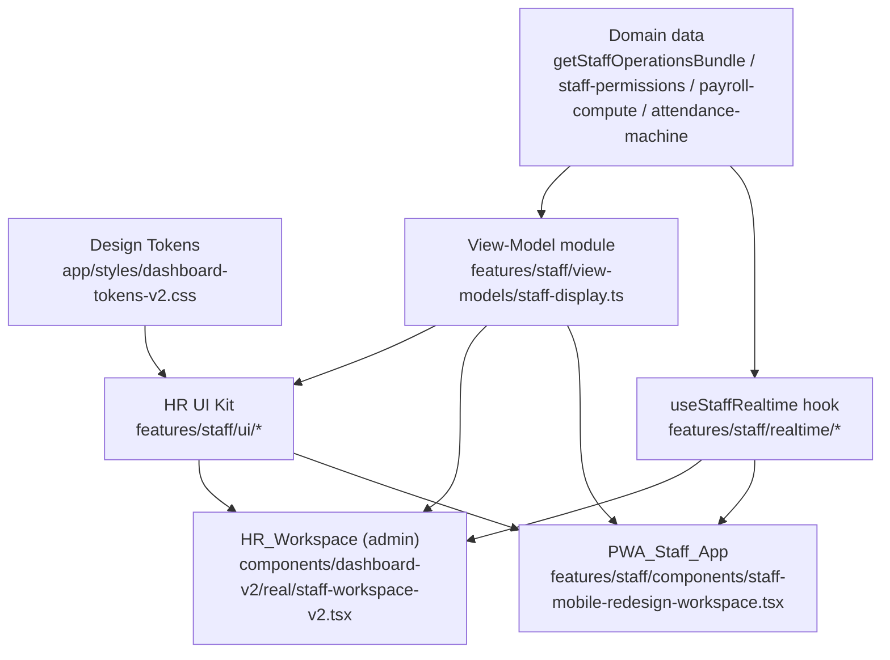

# Design Document — staff-hr-redesign

## Overview

Đợt "thay máu" này hợp nhất hai bề mặt nhân sự (HR_Workspace phía admin và PWA_Staff_App phía nhân viên) về **một ngôn ngữ thiết kế và một nguồn chân lý hiển thị duy nhất**, đồng thời đại tu layout theo hướng ưu tiên vận hành (operation-first) và đồng bộ thời gian thực giữa hai bề mặt.

### Mục tiêu thiết kế
- Một hệ token `var(--d-*)` dùng chung cho cả desktop và mobile (Req 1, 7).
- Một bộ component HR dùng chung (HR UI Kit) render giống hệt trên 2 bề mặt (Req 2).
- Một module view-model thuần ánh xạ domain → `{label, tone, icon}`, import bởi cả 2 bề mặt để không bao giờ lệch nhãn/màu (Req 3, 6).
- Layout mới cho admin (Req 4) và PWA (Req 5), đồng bộ chặt qua realtime (Req 6).
- Dọn dẹp legacy (Req 8) và không hồi quy backend/quyền/anti-fraud (Req 9).

### Out of scope
- KHÔNG đổi hợp đồng API backend hay schema DB (Req 9).
- KHÔNG xây payroll-run pipeline (nỗ lực riêng).

## Architecture

Chiến lược "single source of truth": giá trị thị giác chỉ đến từ **Tokens**; biểu diễn ngữ nghĩa (nhãn/màu/icon) chỉ đến từ **View-Model module**; UI nguyên thuỷ chỉ đến từ **HR UI Kit**. Hai bề mặt chỉ lắp ráp (compose), không tự định nghĩa màu/nhãn/primitive.



## 3. Shared Design System (Req 1, 7)

Mở rộng `app/styles/dashboard-tokens-v2.css` (đã có `--d-jade #0F4D3A`, spacing, radius, shadow) bằng nhóm token mobile/a11y mới:

```css
:root {
  /* Touch & layout (Req 1, 7) */
  --d-touch-min: 44px;                 /* cạnh tối thiểu phần tử chạm */
  --d-touch-gap: 8px;                  /* khoảng cách tối thiểu 2 target */
  --d-safe-top: env(safe-area-inset-top, 0px);
  --d-safe-right: env(safe-area-inset-right, 0px);
  --d-safe-bottom: env(safe-area-inset-bottom, 0px);
  --d-safe-left: env(safe-area-inset-left, 0px);
  --d-bottomnav-h: 72px;               /* trong [56,80] */
  --d-heroclock-h: 168px;
  /* Motion (Req 7) */
  --d-motion-fast: 140ms;
  --d-motion-base: 220ms;              /* trong [100,500] */
  --d-motion-slow: 360ms;
  --d-motion-ease: cubic-bezier(0.4, 0, 0.2, 1);
}
@media (prefers-reduced-motion: reduce) {
  :root { --d-motion-fast: 0ms; --d-motion-base: 0ms; --d-motion-slow: 0ms; }
}
```

### Kế hoạch di trú `staff-brand-*` → token (Req 1.2/1.3/1.4)
- Lập bảng map: mỗi hex/`rgba(15,77,58,*)` trong `app/globals.css` (vùng `.staff-brand-*`, `.dashboard-density`) → token `--d-*` tương đương (jade, surface, line, text…).
- Thay khai báo `staff-brand-*` bằng class trung tính dùng token; gỡ `!important` (thay bằng selector đủ đặc hiệu trong scope `[data-dash="v2"]`).
- Token có phạm vi (scoped) cho biến thể bề mặt: `[data-surface="pwa"] { --d-bottomnav-h: 72px } ` kế thừa từ cùng gốc, không tách hệ (Req 1.5).
- Fallback token thiếu: dùng cú pháp `var(--d-x, <default>)` + 1 guard test cảnh báo (Req 1.7).

## Components and Interfaces

### HR UI Kit (Req 2)

Vị trí: `features/staff/ui/` (barrel `index.ts`). Mỗi component build trên primitives `components/dashboard-v2/{button,overlay,primitives}` và chỉ nhận giá trị thị giác từ token.

```ts
// features/staff/ui/types.ts
export type Tone = "jade" | "info" | "ok" | "orange" | "danger" | "neutral";
export type ViewModel = { label: string; tone: Tone; icon: LucideIcon };
export type Surface = "admin" | "pwa";
```

Danh sách (≥11) + chữ ký props rút gọn:

```ts
StatusPill({ vm: ViewModel; size?: "sm" | "md" })
ShiftChip({ label: string; startTime: string; endTime: string; tone?: Tone; surface?: Surface })
AttendanceClock({ now: Date; state: ViewModel; sources: AttendanceSourceChip[]; onClock: () => void })
ApprovalCard({ vm: ViewModel; title: string; detail?: string; createdAt: string; actions?: ReactNode })
StaffIdentityCard({ fullName: string; employeeCode: string | null; role: ViewModel; shift?: ViewModel; avatarUrl?: string | null })
MetricStrip({ items: { label: string; value: string; tone?: Tone }[] })
PermissionMatrix({ groups: StaffPermissionGroup[]; granted: Set<string>; onToggle?: (k: string) => void; readOnly?: boolean })
FormField({ label: string; name: string; type?: string; defaultValue?: string; required?: boolean; hint?: string })
ListRow({ leading?: ReactNode; title: ReactNode; subtitle?: ReactNode; trailing?: ReactNode; onClick?: () => void })
EmptyState({ icon: ReactNode; title: string; description?: string; action?: ReactNode })
Sheet / Drawer / Modal  // re-export từ components/dashboard-v2/overlay (đã hỗ trợ Sheet mobile)
```

- Biến thể desktop/mobile qua prop `surface` + token scoped, KHÔNG fork component (Req 2.2/2.3).
- Cùng input → cùng nhãn/tone/icon trên 2 bề mặt (Req 2.5); thiếu/sai field → fallback xác định, giữ layout (Req 2.6).

## Data Models

### Shared View-Model module (Req 3, 6)

File mới `features/staff/view-models/staff-display.ts` — thuần (no "server-only", no React) để dùng được ở cả client admin lẫn PWA. Re-export tone từ token set.

```ts
import type { Tone, ViewModel } from "@/features/staff/ui/types";

const FALLBACK: ViewModel = { label: "Không xác định", tone: "neutral", icon: HelpCircle };

export function attendanceStateVM(state: string): ViewModel { /* on_time/late/overtime/early_leave/absent/none */ }
export function approvalTypeVM(type: string): ViewModel { /* outside_location/overtime/shift_override/manual_clock_in/leave_request/shift_swap/... */ }
export function staffRoleVM(roleCode: string): ViewModel { /* dùng STAFF_ROLE_TEMPLATES + ROLE_LABEL/ROLE_TONE */ }
export function payrollStatusVM(status: string): ViewModel { /* draft/computed/locked/paid */ }
export function vmOrFallback(vm: ViewModel | undefined): ViewModel { return vm ?? FALLBACK; }
```

Bảng ánh xạ (trích) — đây là nguồn chân lý nhãn+màu+icon:

| Domain | value | label | tone | icon |
|---|---|---|---|---|
| Attendance_State | on_time | Đúng giờ | ok | CheckCircle2 |
| Attendance_State | late | Đi muộn | orange | Clock3 |
| Attendance_State | absent | Vắng | danger | XCircle |
| Approval | outside_location | Chấm công ngoài vùng | orange | MapPin |
| Approval | leave_request | Xin nghỉ | info | CalendarClock |
| Role | manager | Quản lý | info | UserCog |
| Payroll | locked | Đã chốt | jade | ShieldCheck |

- Mọi value không map → `FALLBACK` (Req 3.7), label ≤50 ký tự, tone ∈ Tone set (Req 3.1-3.4).
- Admin và PWA cùng gọi các hàm này (Req 3.5/3.6) ⇒ parity (Req 3.8, 6.2).
- Hiện trạng cần gom: `ROLE_LABEL`/`ROLE_TONE`/`APPROVAL_TYPE_LABEL`/`shiftLabel` đang nằm trong `staff-workspace-v2.tsx` → chuyển vào module này; PWA import lại.

## 6. Admin HR layout redesign (Req 4)

Bố cục mới của `staff-workspace-v2.tsx`:
- **"Hôm nay" snapshot strip** (above the fold): đang trong ca · vắng/đi muộn · chờ duyệt · ca trống — dữ liệu trong ngày (Req 4.1) qua `MetricStrip`.
- **5 khu vực** theo thứ tự (Req 4.2): Đội ngũ · Ca & Lịch · Chấm công & Duyệt · Lương · Hồ sơ & Tuân thủ. Map view hiện có: team→Đội ngũ, shifts→Ca & Lịch, attendance+approvals→Chấm công & Duyệt, payroll→Lương, AdvancedStaffPanel→Hồ sơ & Tuân thủ.
- **Responsive** (Req 4.3/4.4): `DataTable` chuyển sang danh sách `ListRow`/card khi `< 768px`.
- **Drawer NV**: header `StaffIdentityCard` + trạng thái ca realtime ≤5s (Req 4.5); giữ 4 tab hiện có.
- **Error state** (Req 4.6): snapshot/shift lỗi → EmptyState error, giữ 5 khu vực.
- **Refactor an toàn** (Req 4.7): tách file ~3800 dòng theo từng section ra `components/dashboard-v2/real/staff/<section>.tsx`, giữ nguyên action wiring, không big-bang.

## 7. PWA layout redesign — mobile-first, theo vai trò (Req 5, 10)

PWA_Staff_App là **app vận hành của nhân viên**, không phải bản thu nhỏ của admin. Nguyên tắc: **mobile-first tuyệt đối** (một cột dọc, `max-w-[640px]`, không sidebar/đa cột desktop — Req 5.9) và **bề mặt phân giải theo quyền** (Req 10).

### 7.1 Khung mobile-first
- `staff-mobile-redesign-workspace.tsx` render một `<section>` cột dọc duy nhất `mx-auto w-full max-w-[640px]`, padding tôn trọng `--d-safe-*`; đã gỡ bố cục 2 cột + `<aside>` desktop.
- Bottom-nav cố định cạnh dưới, chiều cao `--d-bottomnav-h`, chừa `--d-safe-bottom`; đúng 1 tab active (Req 5.1).
- Token migration: thay hex inline + `.staff-brand-*` bằng `--d-*` (Req 5.8, 1.2–1.4).

### 7.2 Module Registry (Req 10.2, 10.5)
Khai báo tập trung tại `features/staff/components/mobile/module-registry.ts` (thuần, no server-only):

```ts
export type StaffModuleId =
  | "home" | "kitchen" | "cashier" | "service" | "delivery"
  | "accounting" | "marketing" | "ops" | "requests" | "inbox" | "profile";

export type StaffModule = {
  id: StaffModuleId;
  label: string;
  icon: LucideIcon;
  gate: StaffPermissionKey | null;   // null = Baseline_Module luôn hiển thị
  priority: number;                  // càng nhỏ càng ưu tiên ô bottom-nav
  kind: "baseline" | "operational" | "comms";
};

export const STAFF_MODULES: StaffModule[] = [
  { id: "home",       label: "Hôm nay",   icon: Home,         gate: null,                priority: 0,  kind: "baseline" },
  { id: "kitchen",    label: "Bếp",       icon: ChefHat,      gate: "kitchen.view",      priority: 10, kind: "operational" },
  { id: "cashier",    label: "Thu ngân",  icon: Wallet,       gate: "payments.confirm",  priority: 11, kind: "operational" },
  { id: "service",    label: "Phục vụ",   icon: Utensils,     gate: "tables.manage",     priority: 12, kind: "operational" },
  { id: "delivery",   label: "Giao hàng", icon: Bike,         gate: "online.manage",     priority: 13, kind: "operational" },
  { id: "accounting", label: "Kế toán",   icon: Calculator,   gate: "reports.view",      priority: 14, kind: "operational" },
  { id: "marketing",  label: "Marketing", icon: Megaphone,    gate: "promotions.manage", priority: 15, kind: "operational" },
  { id: "ops",        label: "Điều hành", icon: ClipboardCheck, gate: "approvals.review",priority: 16, kind: "operational" },
  { id: "requests",   label: "Yêu cầu",   icon: CalendarClock,gate: null,                priority: 90, kind: "baseline" },
  { id: "inbox",      label: "Hộp thư",   icon: Bell,         gate: null,                priority: 91, kind: "comms" },
  { id: "profile",    label: "Hồ sơ",     icon: User,         gate: null,                priority: 99, kind: "baseline" }
];
```

### 7.3 Thuật toán phân giải bottom-nav (Req 10.1, 10.3, 10.4, 10.6, 10.9)
`resolveStaffModules(effectivePermissions: Set<string>): { nav: StaffModule[]; overflow: StaffModule[] }`

1. Baseline luôn vào nav: `home`, `requests`, `profile` (gate=null).
2. Operational module vào nhóm "đã mở khoá" nếu `gate ∈ effectivePermissions`.
3. Sắp xếp operational đã mở khoá theo `priority` tăng dần.
4. Số ô còn lại cho operational = `5 − số_baseline_trong_nav` (= 2 khi đủ home/requests/profile). Lấy top theo ưu tiên vào nav; phần dư đẩy sang `overflow` (hiển thị trong tab "Hôm nay" dạng lối tắt — Req 10.6).
5. Nếu **không** có operational nào mở khoá → chèn `inbox` vào ô trống để vẫn đủ ngữ cảnh (Req 10.4 vẫn đảm bảo baseline).
6. Nếu `effectivePermissions` rỗng/không tải được → chỉ baseline + chỉ báo "quyền chưa sẵn sàng" (Req 10.9).

Thứ tự render nav cố định trực quan: `home` → (operational theo ưu tiên) → `requests` → `profile`, đảm bảo đúng 1 active.

### 7.4 Nội dung từng Role_Module (Req 10.5, 10.7)
Mỗi module render bằng HR UI Kit + view-model, chỉ hiện hành động mà quyền cho phép:
- **home** (baseline): hero `AttendanceClock` + 3 chip GPS/QR/WiFi (Req 5.2/5.3), ca hôm nay, lối tắt overflow module.
- **kitchen** (`kitchen.view`): hàng chờ món/tiến độ (đọc từ orders), tín hiệu nguyên liệu nếu có `inventory.view`.
- **cashier** (`payments.confirm`): xác nhận thanh toán, đóng bàn, lịch sử giao dịch trong ca.
- **service** (`tables.manage`): bàn được giao, đơn tại chỗ, đặt bàn nếu có `reservations.manage`.
- **delivery** (`online.manage`): đơn online, cập nhật trạng thái giao.
- **accounting** (`reports.view`): báo cáo cuối ca, đối soát, nhật ký (nếu `activity_logs.view`), xuất dữ liệu (nếu `activity_logs.export`).
- **marketing** (`promotions.manage`): khuyến mãi, kênh online, hiệu quả bán.
- **ops** (`approvals.review`): duyệt yêu cầu, phân ca nhanh (nếu `shifts.assign`), đội ngũ trong ca (nếu `staff.view`).
- **requests** (baseline): tạo/nghỉ phép/đổi ca/tăng ca + danh sách `ApprovalCard` của chính NV (Req 5.5/5.6).
- **inbox** (comms): `bundle.notifications`.
- **profile** (baseline): đổi mật khẩu · lương read-only (`getStaffPayrollSelfView`, không control sửa) · báo cáo sự cố (Req 5.7).

### 7.5 Wiring quyền + realtime (Req 10.1, 10.8, 10.10)
- `app/dashboard/staff/mobile/page.tsx` gọi `getStaffEffectivePermissions(session)` → truyền `effectivePermissions: string[]` xuống workspace; workspace tạo `Set` và gọi `resolveStaffModules`.
- Gating UI **đồng nhất** với server: mọi action của module vẫn đi qua server action/route handler đang gọi `assertStaffActionPermission(...)` (Req 10.8) — UI chỉ ẩn/disable, server vẫn là người quyết định cuối.
- `useStaffRealtime(scope:"self")` lắng nghe `staff_members`/`notifications`…; khi vai trò/quyền đổi → `router.refresh()` ⇒ page nạp lại `effectivePermissions` ⇒ phân giải lại module ≤3s (Req 10.10).
- Đã sửa lỗi sàn quyền liên quan tại `services/staff-permission-service.ts` (`applyAdministratorPermissionFloor`): chủ quán/ADMIN không bao giờ bị khoá khỏi quản lý nhân sự dù hồ sơ cấu hình sai — củng cố Req 9.3 và là nguồn `effectivePermissions` tin cậy cho Req 10.

## 8. Cross-surface synchronization (Req 6)

### Concept ↔ Surface mapping

| Concept | HR_Workspace | PWA_Staff_App | Nguồn chung |
|---|---|---|---|
| Trạng thái ca | cột bảng + StatusPill | hero clock + StatusPill | `attendanceStateVM` |
| Ca/lịch | WeekScheduleGrid + ShiftChip | lịch tuần + ShiftChip | `ShiftChip` |
| Yêu cầu duyệt | hàng đợi + ApprovalCard | tab Yêu cầu + ApprovalCard | `approvalTypeVM` + `ApprovalCard` |
| Vai trò/quyền | PermissionMatrix | badge read-only | `staffRoleVM` + `staff-permissions` |
| Lương | PayrollView | lương read-only | `payrollStatusVM` + `payroll-compute` |
| Định danh NV | StaffIdentityCard | Profile header | `StaffIdentityCard` |

### `useStaffRealtime` hook
Gom `useStaffMobileRealtime` hiện có thành `features/staff/realtime/use-staff-realtime.ts` dùng chung, subscribe: `staff_members`, `attendance_logs`, `attendance_approval_requests`, `shift_assignments`, `notifications`.

```ts
useStaffRealtime({ restaurantId, scope: "admin" | "self", onChange })
// trả về: { state: "connecting"|"connected"|"error", lastSyncedAt, pending }
```

- Khi có sự kiện → `router.refresh()` (debounce) ⇒ phản ánh ≤3s (Req 6.3-6.6).
- Mất kết nối/timeout >3s → hiển thị chỉ báo "chưa đồng bộ" (badge realtime), giữ dữ liệu cũ (Req 6.7).
- Reconnect → áp dụng thay đổi chờ + xoá chỉ báo ≤3s (Req 6.8).

## 9. Accessibility & responsive (Req 7)
- Mọi control dùng token `--d-touch-min`/`--d-touch-gap`; focus-visible ring 2px contrast ≥3:1.
- Contrast văn bản ≥4.5:1 (thường), ≥3:1 (lớn) — chọn cặp token text/surface đạt chuẩn.
- PWA padding theo `--d-safe-*` cả 4 cạnh; bottom-nav + hero chừa safe-area.
- 3 trạng thái loading/empty/error nhất quán qua `EmptyState`/skeleton dùng chung; error có nguyên nhân + nút thử lại.
- Motion qua `--d-motion-*`; tôn trọng `prefers-reduced-motion`.

## 10. Legacy cleanup (Req 8)
- `grep` xác minh 0 tham chiếu tới `staff-redesign-workspace`, `staff-operations-workspace`, `staff-mobile-workspace`, `staff-ui-reset-placeholder` trước khi xoá.
- Lưu ý: một số guard test hiện đang đọc `features/staff/components/staff-redesign-workspace.tsx` và `staff-operations-workspace.tsx` (trong `staff-operations-validators.test.ts`). ⇒ Chỉ xoá sau khi chuyển assertion sang surface mới; nếu còn tham chiếu thì giữ file (Req 8.4) và rollback nếu test gãy (Req 8.5).
- Sau dọn: build + typecheck 0 lỗi (Req 8.3), guard tests 100% pass (Req 8.2).

## Correctness Properties

### Property 1: Parity hiển thị giữa 2 bề mặt
Với cùng một giá trị domain, `staff-display.ts` luôn trả về cùng `{label, tone, icon}` ⇒ HR_Workspace và PWA_Staff_App không thể hiển thị lệch nhau.
**Validates: Requirements 3.8, 6.2**

### Property 2: Token-only cho giá trị thị giác
Mọi giá trị thị giác của HR UI Kit chỉ đến từ `var(--d-*)`; không tồn tại hex cứng hoặc `!important` trong vùng style staff.
**Validates: Requirements 1.2, 1.4, 2.4**

### Property 3: Tone đóng + fallback xác định
`tone` luôn thuộc tập `Tone` hữu hạn; value không có ánh xạ → `FALLBACK`.
**Validates: Requirements 3.7**

### Property 4: Không hồi quy backend/quyền/anti-fraud
Tập hành động cho mỗi vai trò và kết quả anti-fraud không đổi so với trước đợt đại tu.
**Validates: Requirements 9.3, 9.4**

### Property 5: Đúng-một-trạng-thái
Mỗi vùng nội dung tại một thời điểm chỉ ở đúng một trong {data, loading, empty, error}; bottom-nav luôn đúng 1 tab active.
**Validates: Requirements 7.5, 5.1**

### Property 6: Bề mặt PWA bám đúng quyền (role-gated parity)
`resolveStaffModules` chỉ đưa vào nav các Baseline_Module + các operational module có `gate ∈ Effective_Permissions`; mọi action trong module đều đi qua `assertStaffActionPermission` phía server ⇒ UI và server không thể lệch quyền (action ẩn cũng bị server từ chối; action hiện cũng được server chấp nhận).
**Validates: Requirements 10.1, 10.3, 10.8**

### Property 7: Sàn quyền quản trị không thể bị khoá
Với `user.role === "ADMIN"` (hoặc `roleCode === "owner"`), `getStaffEffectivePermissions` luôn merge sàn template (owner → toàn quyền, ADMIN khác → manager) ⇒ chủ quán/quản trị không bao giờ mất quyền quản lý nhân sự dù staff_members/role_permissions cấu hình sai.
**Validates: Requirements 9.3**

## Error Handling

- **Token thiếu**: `var(--d-x, <default>)` đảm bảo render không vỡ; guard test cảnh báo token thiếu (Req 1.7).
- **Dữ liệu component thiếu/sai**: HR UI Kit render fallback xác định, giữ layout, gắn chỉ báo dữ liệu không hợp lệ (Req 2.6).
- **Snapshot/shift lỗi tải**: hiển thị error state có nguyên nhân + nút thử lại, giữ bố cục 5 khu vực (Req 4.6, 7.5).
- **Realtime gián đoạn**: chỉ báo "chưa đồng bộ", giữ dữ liệu cũ; reconnect → reconcile ≤3s (Req 6.7/6.8).
- **Vi phạm hợp đồng**: thay đổi làm sai lệch API/schema/quyền/anti-fraud bị chặn ở review/CI, nêu rõ thành phần vi phạm, giữ nguyên trạng thái (Req 9.7).

## Testing Strategy
- **View-model**: unit test thuần — mọi value có map, fallback đúng, label ≤50 ký tự, parity (cùng input → cùng VM).
- **Token/lint guard** (kiểu source-assert như `inventory-premium-foundation.test.ts`): assert 0 hex cứng & 0 `!important` trong vùng staff styles; token mobile tồn tại.
- **Component fallback**: render thiếu field → không vỡ layout.
- **Regression**: giữ các test trong `lib/staff-operations-validators.test.ts` (permission-first, anti-fraud, attendance machine) xanh; không đổi action/permission gating (Req 9.2-9.5).
- `npx tsc --noEmit` + `npx tsx --test` toàn bộ trước khi đóng từng phase.

## 12. Phased rollout
- **P0 — Nền tảng**: token mobile + map staff-brand→token, HR UI Kit, view-model module, `useStaffRealtime`, guard tests. (Req 1,2,3,7 + nền 6,8)
- **P1 — Admin**: snapshot + 5 section + responsive + drawer. (Req 4)
- **P2 — PWA**: bottom-nav + hero clock + tuần + approval + hồ sơ + token migration. (Req 5)
- **P3 — Sync**: concept mapping hiện thực + realtime 2 chiều + chỉ báo chưa đồng bộ. (Req 6)
- **P4 — A11y/QA + cleanup**: a11y polish, dọn legacy, regression. (Req 7,8,9)

## 13. Requirements coverage

| Design section | Requirements |
|---|---|
| 3 Shared Design System | 1, 7 |
| 4 HR UI Kit | 2 |
| 5 View-Model module | 3, 6 |
| 6 Admin layout | 4 |
| 7 PWA layout (mobile-first + role module) | 5, 10 |
| 8 Synchronization | 6 |
| 9 Accessibility | 7 |
| 10 Legacy cleanup | 8 |
| 11 Testing | 9 (+ all) |
| 12 Phased rollout | 1–9 |
