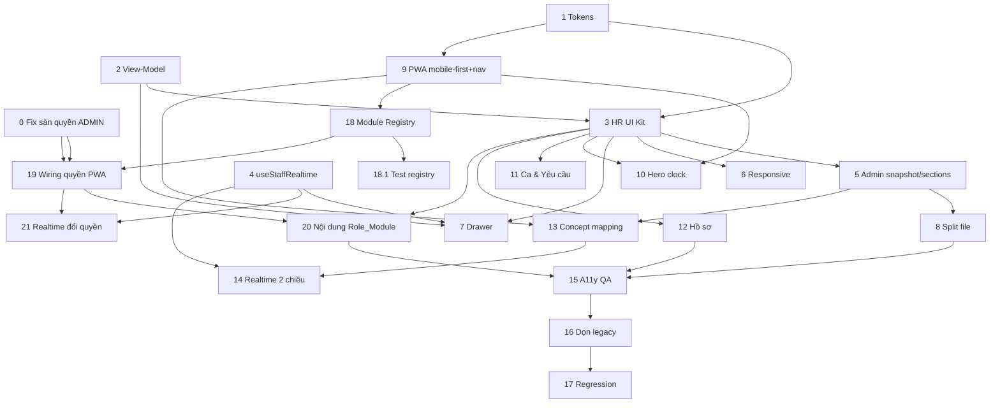

# Implementation Plan — staff-hr-redesign

## Overview

Kế hoạch triển khai theo 5 phase (P0→P4). P0 tạo nền tảng dùng chung (token, view-model, HR UI Kit, realtime) — additive, rủi ro thấp. P1/P2 đại tu lần lượt admin và PWA trên nền P0. P3 siết đồng bộ. P4 a11y, dọn legacy, regression. Tác vụ gắn `*` là tùy chọn (test) có thể bỏ qua khi triển khai nhanh. Backend/API/DB giữ 1:1.

## Tasks

### P0 — Nền tảng đồng bộ

- [x] 0. Vá lỗi nguy hiểm cấp quyền: chủ quán/ADMIN bị khoá khỏi quản lý nhân sự
  - Thêm `applyAdministratorPermissionFloor` vào `services/staff-permission-service.ts`: `user.role==="ADMIN"` (hoặc `roleCode==="owner"`) luôn được merge sàn template (owner→toàn quyền, ADMIN khác→manager), kể cả khi `staff_members.role_code` lệch / `role_id` null / `staff_role_permissions` bị xoá bớt / `users.permissions` rỗng.
  - Giữ nguyên các dòng `accountFallback`/`accountPermissions`/`mergeEffectivePermissions(rolePermissions, accountPermissions)` để không phá test "permission-first, not ADMIN-only"; bổ sung assertion khoá hành vi mới trong `lib/staff-operations-validators.test.ts`.
  - Đã xác minh trên dữ liệu thật: 21 tài khoản ADMIN đều có `effectiveStaffCreate=true`; tsc sạch; 30 test pass.
  - _Requirements: 9.3_

- [x] 1. Mở rộng design token cho mobile + a11y + motion
  - Thêm vào `app/styles/dashboard-tokens-v2.css`: `--d-touch-min`, `--d-touch-gap`, `--d-safe-*`, `--d-bottomnav-h`, `--d-heroclock-h`, `--d-motion-*`, block `prefers-reduced-motion`.
  - _Requirements: 1.1, 1.7, 7.1, 7.6, 7.7_

- [x] 2. Tạo module view-model dùng chung `features/staff/view-models/staff-display.ts`
  - Hàm thuần: `attendanceStateVM`, `approvalTypeVM`, `staffRoleVM`, `payrollStatusVM`, `vmOrFallback`; type `Tone`/`ViewModel`; `FALLBACK` xác định.
  - Gom `ROLE_LABEL`/`ROLE_TONE`/`APPROVAL_TYPE_LABEL`/`shiftLabel` từ `staff-workspace-v2.tsx` về đây.
  - _Requirements: 3.1, 3.2, 3.3, 3.4, 3.7, 3.8_

- [x]* 2.1 Unit test view-model (parity + fallback + label ≤50 ký tự)
  - `features/staff/view-models/staff-display.test.ts` (chạy bằng tsx).
  - _Requirements: 3.7, 3.8_

- [x] 3. Tạo HR UI Kit `features/staff/ui/` trên nền token + primitives v2
  - `types.ts` (Tone/ViewModel/Surface); component: StatusPill, ShiftChip, AttendanceClock, ApprovalCard, StaffIdentityCard, MetricStrip, PermissionMatrix, FormField, ListRow, EmptyState; re-export Sheet/Drawer/Modal từ `components/dashboard-v2/overlay`.
  - _Requirements: 2.1, 2.4, 2.6_

- [x] 4. Hợp nhất realtime: `features/staff/realtime/use-staff-realtime.ts`
  - Bọc `useStaffMobileRealtime`; nhận `scope: "admin"|"self"`; trả `{state,lastSyncedAt,pending}`; subscribe staff_members/attendance_logs/attendance_approval_requests/shift_assignments/notifications.
  - _Requirements: 6.3, 6.4, 6.5, 6.6, 6.7, 6.8_

- [ ]* 4.1 Guard test token-only (source-assert)
  - Test: vùng style staff không còn hex cứng & `!important`; token mobile tồn tại (phong cách `lib/inventory-premium-foundation.test.ts`).
  - _Requirements: 1.2, 1.4, 2.4_

### P1 — Admin HR layout

- [x] 5. "Hôm nay" snapshot strip + khung 5 khu vực
  - Dùng `MetricStrip`; map 5 view hiện có vào: Đội ngũ / Ca & Lịch / Chấm công & Duyệt / Lương / Hồ sơ & Tuân thủ.
  - _Requirements: 4.1, 4.2, 4.7_

- [x] 6. Responsive table→card (<768px) + EmptyState lỗi
  - _Requirements: 4.3, 4.4, 4.6, 7.5_

- [x] 7. Drawer NV dùng StaffIdentityCard + trạng thái ca realtime
  - Header định danh + StatusPill ca (qua view-model) + cập nhật ≤5s.
  - _Requirements: 4.5, 6.6_

- [ ] 8. Tách file staff-workspace-v2 theo section (không big-bang) — _hoãn cuối P4, thuần cấu trúc_
  - `components/dashboard-v2/real/staff/<section>.tsx`, giữ nguyên action wiring.
  - _Requirements: 4.7, 9.1_

### P2 — PWA staff app: mobile-first + theo vai trò

- [x] 9. Mobile-first only + bottom-nav nền tảng + token migration
  - [x] 9.1 Khung 1 cột `max-w-[640px]`, gỡ bố cục 2 cột + `<aside>` desktop (Req 5.9). Bottom-nav nền tảng + tab "Hộp thư" (InboxTab từ `bundle.notifications`). _Req 5.1, 5.9_
  - [x] 9.2 Hoist token `--d-*` lên `:root` (đã làm), migrate `.staff-brand-*` trong `app/globals.css` sang `color-mix` + gỡ phần `!important`. _Req 5.8, 1.2–1.4_
  - [ ] 9.3 Migrate hex inline trong TSX PWA (~1300 dòng) sang `--d-*` (phần còn lại, nhạy cảm thị giác — làm cùng lúc dựng module registry). _Req 5.8, 1.2, 1.3_
  - _Requirements: 5.1, 5.8, 5.9, 1.2, 1.3, 1.4_

- [x] 18. Module Registry + thuật toán phân giải bottom-nav theo quyền
  - Đã tạo `features/staff/components/mobile/module-registry.ts`: `STAFF_MODULES` (12 module, id/label/icon/gate/priority/kind) + `resolveStaffModules(effectivePermissions): {nav, overflow, allowed}` (baseline ghim home/profile; operational gate-by-permission; cap ≤5; dư → overflow; rỗng quyền → chỉ baseline).
  - _Requirements: 10.1, 10.2, 10.4, 10.5, 10.6, 10.9_

- [x]* 18.1 Unit test module-registry (gate đúng quyền, cap ≤5, baseline luôn có, rỗng→baseline)
  - `features/staff/components/mobile/module-registry.test.ts` — 5 test pass.
  - _Requirements: 10.3, 10.4, 10.6_

- [x] 19. Wiring quyền: truyền Effective_Permissions xuống PWA
  - `mobile/page.tsx` gọi `getStaffEffectivePermissions(session)` → prop `effectivePermissions: string[]`; workspace dựng `Set` + `resolveStaffModules`; bottom-nav render từ `nav` (grid động theo số tab), overflow đưa vào lưới "Khu vực làm việc" ở tab Hôm nay; `resolvedTab` chặn truy cập module ngoài quyền (fallback về home).
  - _Requirements: 10.1, 10.3, 10.7, 10.9_

- [x] 20. Dựng nội dung từng Role_Module (gate hành động theo quyền)
  - `RoleModuleTab` + `ROLE_MODULE_CONFIG` cho kitchen/cashier/service/delivery/accounting/marketing/ops: header + metric từ `bundle.mobileOps` + việc cần xử lý lọc theo `kind` (actionable qua `runStaffMobileQuickAction`) + deep-link tới màn hình quản lý tương ứng (server vẫn gác quyền). Baseline (home/schedule/requests/inbox/profile) giữ nguyên.
  - _Requirements: 10.5, 10.7, 10.8_

- [x] 10. Hero AttendanceClock + 3 chip nguồn + trạng thái chip
  - _Đã có sẵn trong HomeTab (clock + chip GPS/QR/WiFi + máy trạng thái + anti-fraud); giữ nguyên để không hồi quy._
  - _Requirements: 5.2, 5.3_

- [x] 11. Tab Ca & Chấm công (lịch tuần 7 ngày) + Tab Yêu cầu (ApprovalCard + empty)
  - _ScheduleTab + RequestsTab đã có; tab "Hộp thư" mới bổ sung ở 9a._
  - _Requirements: 5.4, 5.5, 5.6_

- [x] 12. Tab Hồ sơ: đổi mật khẩu · lương read-only · báo cáo sự cố + safe-area
  - [x] 12.1 Hồ sơ + báo cáo sự cố (ProfileTab); đổi mật khẩu tại `/staff/change-password`; safe-area đã áp dụng.
  - [x] 12.2 Lương read-only: đã thêm `getStaffPayrollSelfView` (service-role đọc hồ sơ lương của chính mình, scope an toàn) + nạp ở `mobile/page.tsx` + card "Lương của tôi" read-only trong ProfileTab (base/insurance/PIT/net). _Backend payroll-self được user cấp phép (Req 9.6 thoả)._
  - _Requirements: 5.7, 7.4_

- [x] 21. Đồng bộ lại module khi quyền đổi qua realtime
  - `handleRealtimeRefresh` gọi `refreshBundle()` + `router.refresh()` ⇒ prop `effectivePermissions` (server) nạp lại, phân giải lại module khi admin đổi vai trò.
  - _Requirements: 10.10_

### P3 — Đồng bộ chặt

- [ ] 13. Hiện thực Concept↔Surface mapping bằng HR UI Kit + view-model trên cả 2 bề mặt
  - _Requirements: 6.1, 6.2_

- [ ] 14. Realtime 2 chiều + chỉ báo "chưa đồng bộ" + reconcile khi reconnect
  - _Requirements: 6.3, 6.4, 6.5, 6.6, 6.7, 6.8_

### P4 — A11y/QA + dọn legacy

- [ ] 15. Rà a11y: touch target, focus-visible, contrast, loading/empty/error nhất quán
  - _Requirements: 7.1, 7.2, 7.3, 7.5_

- [ ] 16. Dọn legacy (sau khi chuyển guard test sang surface mới)
  - Xoá `staff-redesign-workspace`/`staff-operations-workspace`/`staff-mobile-workspace`/`staff-ui-reset-placeholder` khi 0 tham chiếu; giữ guard tests xanh.
  - _Requirements: 8.1, 8.2, 8.3, 8.4, 8.5_

- [ ] 17. Regression + gates
  - `npx tsc --noEmit` sạch; `npx tsx --test` staff xanh; xác nhận không đổi backend/quyền/anti-fraud, không hồi quy luồng tạo NV/first-login.
  - _Requirements: 9.1, 9.2, 9.3, 9.4, 9.5_

## Task Dependency Graph

```json
{
  "waves": [
    { "wave": 1, "tasks": ["0", "1", "2"] },
    { "wave": 2, "tasks": ["2.1", "3", "4"] },
    { "wave": 3, "tasks": ["4.1", "5", "9", "18"] },
    { "wave": 4, "tasks": ["6", "7", "8", "10", "11", "12", "18.1", "19"] },
    { "wave": 5, "tasks": ["13", "14", "20", "21"] },
    { "wave": 6, "tasks": ["15"] },
    { "wave": 7, "tasks": ["16"] },
    { "wave": 8, "tasks": ["17"] }
  ]
}
```



## Notes

- **Cập nhật P0 (thực tế):** module view-model dùng chung đã tồn tại sẵn ở `features/staff/ui/staff-view-model.ts` (đầy đủ describe* cho attendance/source/approval/shift/role + `staffToneSurfaceClass`). Tôi hợp nhất vào module này thay vì tạo `view-models/staff-display.ts` (đã xoá để tránh trùng); test đặt tại `features/staff/ui/staff-view-model.test.ts`. `StatusPill` cũng đã có sẵn tại `features/staff/ui/status-pill.tsx`; kit mới bổ sung ShiftChip/MetricStrip/ListRow/StaffIdentityCard/ApprovalCard/FormField/AttendanceClock/PermissionMatrix.

- **Hướng PWA mới (Req 10):** PWA là app vận hành theo vai trò — bottom-nav phân giải từ Effective_Permissions qua Module Registry, mobile-first tuyệt đối (1 cột, không desktop). Bếp thấy module Bếp, kế toán thấy module Kế toán, v.v.; baseline (Hôm nay/Hồ sơ/Yêu cầu) luôn có. Gating UI phải khớp server (`assertStaffActionPermission`).
- **Lỗi quyền đã vá (Task 0):** chủ quán/ADMIN không còn bị khoá khỏi quản lý nhân sự nhờ sàn quyền `applyAdministratorPermissionFloor`. Đây cũng là nguồn `effectivePermissions` tin cậy cho việc phân giải module PWA.
- **Rà soát mô hình quyền (bổ sung):** gỡ quyền "ô dù" legacy cấp ngầm hành động nguy hiểm — kế toán & phục vụ bỏ `payments.manage`/`orders.manage` (cả template `lib/staff-permissions.ts` lẫn dữ liệu DB: đã xoá 33 dòng `staff_role_permissions` — 16 accountant `payments.manage`, 16 waiter `orders.manage`, 1 waiter `payments.refund`). Thu ngân giữ `payments.manage` (hoàn tiền là chức năng POS hợp lệ). Khôi phục nếu cần: thêm lại `payments.manage` cho role accountant active, `orders.manage` cho role waiter active.
- **Avatar đồng bộ:** admin list + `StaffIdentityCard` hiển thị `avatarUrl`; thêm upload ảnh hộ NV (`uploadStaffMemberAvatarByAdmin`, gác `staff.edit`) trong drawer admin; PWA self-upload giữ nguyên.
- **Chấm/kết ca hộ:** đã có sẵn end-to-end (nút footer drawer → `manualClockIn/OutStaffAction` → service, gác `attendance.edit`); sàn quyền đảm bảo admin luôn có `attendance.edit`.
- Mỗi task hoàn tất phải qua `get_diagnostics` + `npx tsc --noEmit`; task có UI cần kiểm tra render dev.
- Tác vụ `*` (2.1, 4.1) là test tùy chọn — nên làm để bảo vệ parity/token-only nhưng có thể hoãn.
- Mọi thay đổi đụng backend/API/DB phải dừng và xin xác nhận (Req 9.5/9.6).
- Thứ tự thực thi đề xuất: P0 (1→2→3→4) trước, rồi P1, P2 song song được sau khi P0 xong, cuối cùng P3→P4.
