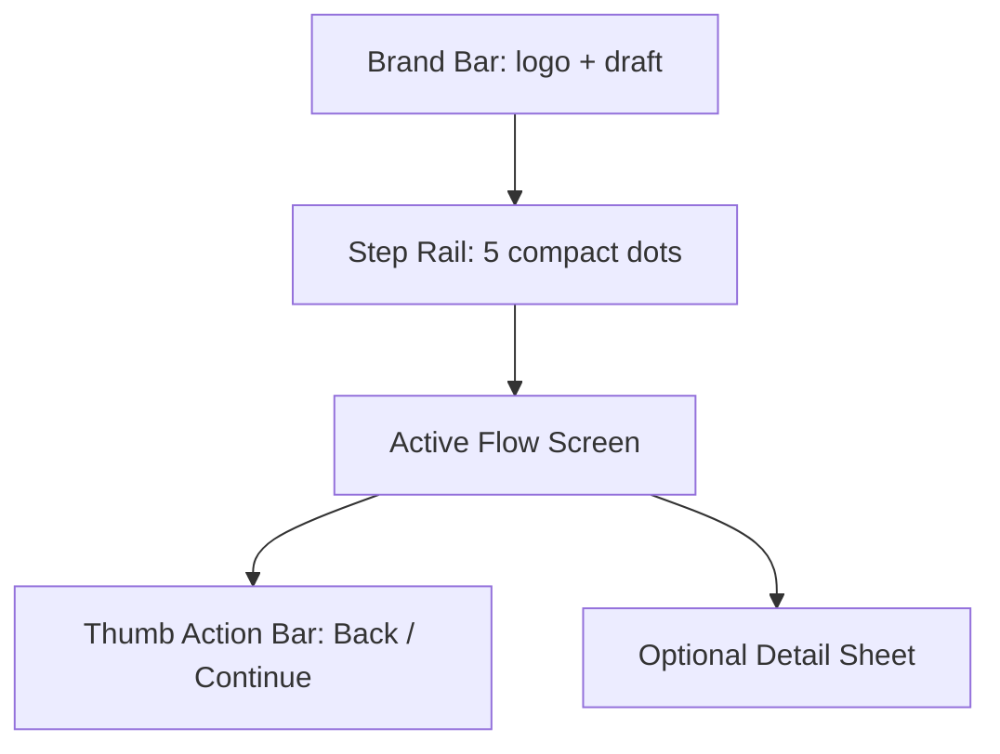

# LogiVN Onboarding Mobile Flow Sketch

Date: 2026-05-31  
Scope: `/dashboard/onboarding`, `components/dashboard/restaurant-onboarding-flow.tsx`, related onboarding CSS in `app/globals.css`.

## Goal

Make restaurant creation feel like a focused LogiVN mobile setup flow instead of a compressed desktop wizard. Each step should fit one clear job on one phone screen, with only the controls needed for that job visible.

## Current Friction

- The mobile screen carries header, live card, status grid, stepper, support preview, step explanation, form content, and footer action at the same time.
- The LogiVN brand palette is present, but the rhythm feels noisy: too many pale panels, many rounded cards, uppercase labels, and duplicated status copy.
- The support panel competes with the actual form on mobile, making setup feel like a dashboard report instead of a guided action.
- Step 0 is especially heavy: restaurant name, slug, business type, address hierarchy, GPS/search, suggestions, and hotline appear as one long form.
- Primary action is in the footer, but the current screen still asks users to visually parse too much before tapping it.

## Brand Direction

Use the existing LogiVN identity:

- Brand cream: `#FFF7EB` / warm paper background.
- Deep green: `#0F4D3A` for primary action, active states, trust markers.
- Soft sage: `#A9C5A1` as quiet supporting surface.
- Orange: `#F28C28` only for attention, warnings, premium hints, and launch energy.
- Logo asset: `/brand/logivn/logo-horizontal-nav.png`.
- Motif assets may be used as subtle edge texture: `/brand/logivn/vietnam-line-motif.svg`.

The target feeling is: calm setup desk, not marketing landing page; confident operations product, not decorative SaaS wizard.

## Mobile Architecture

### Shell

Use a fixed-height mobile app shell:

- Top: compact brand bar, progress pill, draft state.
- Middle: one active flow screen.
- Bottom: sticky action bar in thumb zone.

Remove mobile-only visual/support clutter from the top-level view. Keep desktop support panel for large screens only.



## Proposed Mobile Screens

### 1. Identity Screen

Purpose: establish restaurant identity and code.

Visible controls:

- Restaurant name.
- Restaurant code / slug.
- Business type segmented chips.
- Hotline.

Hidden or deferred:

- Address detail.
- Preview image.
- Long outcome copy.

Layout sketch:

```text
┌─────────────────────────┐
│ LogiVN        Draft ok   │
│ ● ○ ○ ○ ○     22%        │
├─────────────────────────┤
│ Định danh quán           │
│ [Tên quán              ] │
│ [ma-quan               ] │
│ ma-quan.logivn.com  ✓    │
│ [Cafe] [Quán ăn] [Khác]  │
│ [Hotline               ] │
├─────────────────────────┤
│        Tiếp tục          │
└─────────────────────────┘
```

Validation behavior:

- Slug check stays live and canonical via `/api/restaurants/slug`.
- Continue disabled until name, slug, business type, and hotline pass.
- Status copy should be short: `Khả dụng`, `Đã dùng`, `Kiểm tra...`.

### 2. Location Screen

Purpose: find and pin where the restaurant operates.

Visible controls:

- One address input.
- Two action buttons: `GPS` and `Tìm`.
- Suggestions list capped at 3.
- Optional detail toggle for province/ward.

Layout sketch:

```text
┌─────────────────────────┐
│ Vị trí quán       42%    │
├─────────────────────────┤
│ [12 Nguyễn Huệ...]       │
│ [ GPS ]        [ Tìm ]   │
│                         │
│ Gợi ý                   │
│ 1. 12 Nguyễn Huệ...     │
│ 2. Saigon Centre...     │
│                         │
│ + Tỉnh/xã thủ công      │
├─────────────────────────┤
│ Quay lại       Tiếp tục  │
└─────────────────────────┘
```

Validation behavior:

- Continue allowed when `selectedAddress` exists, or composed address plus province/ward/GPS is sufficient.
- Manual province/ward opens inside a small disclosure, never shown by default.

### 3. Plan Screen

Purpose: choose a plan without long comparison copy.

Visible controls:

- Current recommendation strip: `Phù hợp: Pro/Premium`.
- 2 plan cards max per row on tablet, single column on phone.
- Feature summary: max 3 bullets per plan.
- Detail opens in a bottom sheet, not inline expansion.

Layout sketch:

```text
┌─────────────────────────┐
│ Chọn gói          42%    │
├─────────────────────────┤
│ Phù hợp với quán mới     │
│ ┌ Pro ────────────────┐  │
│ │ xxx/tháng · trial   │  │
│ │ QR, bàn, báo cáo    │  │
│ └────────────── Chọn ─┘  │
│ ┌ Premium ────────────┐  │
│ │ AI, staff, mở rộng  │  │
│ └──────────── Chi tiết┘  │
├─────────────────────────┤
│ Quay lại       Tiếp tục  │
└─────────────────────────┘
```

### 4. Setup Review Screen

Purpose: show readiness, not a second dashboard.

Visible controls:

- Four compact checklist rows: identity, plan, tables, menu.
- Tap a row to jump back to the step.
- No illustration on mobile.

Layout sketch:

```text
┌─────────────────────────┐
│ Kiểm tra          70%    │
├─────────────────────────┤
│ 3/4 mục sẵn sàng         │
│ ✓ Định danh quán         │
│ ✓ Gói vận hành           │
│ ○ Bàn & QR               │
│ ○ Menu đầu tiên          │
├─────────────────────────┤
│ Quay lại       Tiếp tục  │
└─────────────────────────┘
```

### 5. Tables Screen

Purpose: set initial table count and preview QR state.

Visible controls:

- Stepper: `- [10] +`.
- Quick presets: `6`, `10`, `16`, `24`.
- Mini QR/table preview with 3 table chips only.

Layout sketch:

```text
┌─────────────────────────┐
│ Bàn & QR          88%    │
├─────────────────────────┤
│ Số bàn ban đầu          │
│      -   10   +         │
│ [6] [10] [16] [24]      │
│ Bàn 01  Bàn 02  VIP     │
│ QR sẵn sau khi tạo quán │
├─────────────────────────┤
│ Quay lại       Tiếp tục  │
└─────────────────────────┘
```

### 6. Menu Screen

Purpose: create the first sellable menu state.

Visible controls:

- Two-mode segmented control: `Nhập nhanh` / `AI đọc menu`.
- Quick mode: item name, price, category.
- AI mode: image/text input, result confirmation list capped visually.
- Final CTA: `Tạo dashboard`.

Layout sketch:

```text
┌─────────────────────────┐
│ Menu đầu tiên     100%   │
├─────────────────────────┤
│ [Nhập nhanh] [AI menu]   │
│ [Tên món               ] │
│ [Giá                   ] │
│ [Danh mục              ] │
│                         │
│ Đã xác nhận: 0 món       │
├─────────────────────────┤
│ Quay lại   Tạo dashboard │
└─────────────────────────┘
```

## Interaction Rules

- Touch targets: every button, chip, row, and link must be at least 44px high.
- Primary CTA stays bottom-right or full-width bottom depending on screen width.
- Back action is secondary, never visually stronger than Continue.
- Disable state must include one short reason above the CTA: `Thiếu hotline`, `Mã quán đã dùng`, etc.
- Draft state is a small top pill only; no repeated draft copy inside each step.
- Address suggestions should not push the CTA off screen more than necessary; cap visible rows to 3 and scroll inside the suggestion area if needed.

## Visual Rules

- Use fewer panels: one shell, one screen surface, one bottom action bar.
- Use 8px border radius for controls and 12-16px for screen surfaces, matching dashboard density rules.
- Do not show the current support/preview panel on phone; keep it for desktop or move it to a bottom sheet named `Xem trước`.
- Replace uppercase tracking-heavy microcopy with plain Vietnamese labels.
- Avoid long explanatory descriptions. Use labels, inline status, and validation messages instead.
- Use lucide icons only where they speed recognition: Store, MapPin, CreditCard, ListChecks, Table2, Utensils.

## Component Mapping

Primary file: `components/dashboard/restaurant-onboarding-flow.tsx`

Recommended extraction after redesign:

- `MobileOnboardingShell`
- `MobileStepRail`
- `MobileIdentityStep`
- `MobileLocationStep`
- `MobilePlanStep`
- `MobileReviewStep`
- `MobileTablesStep`
- `MobileMenuStep`
- `OnboardingBottomActionBar`

The existing business logic can stay in `RestaurantOnboardingFlow` first. Extract only presentation components, passing state/actions down as props. This keeps backend behavior unchanged.

CSS file: `app/globals.css`

Add mobile-specific classes under onboarding section:

- `.onboarding-mobile-shell`
- `.onboarding-mobile-brandbar`
- `.onboarding-mobile-rail`
- `.onboarding-mobile-screen`
- `.onboarding-mobile-fieldset`
- `.onboarding-mobile-actionbar`
- `.onboarding-mobile-sheet`

## Backend Compatibility

No backend changes required for this redesign.

Keep these existing contracts intact:

- Hidden form fields submitted to `onboardingAction`.
- `createSlug` canonical slug logic.
- `/api/restaurants/slug` availability check.
- Local draft persistence key.
- Address/GPS/map APIs.
- Menu OCR API.
- `buildOnboardingRunway` launch readiness.

## Implementation Order

1. Create mobile-only shell and keep desktop layout untouched behind `md`/`lg` breakpoints.
2. Split Step 0 into two mobile screens: Identity and Location, while preserving original `step` semantics internally.
3. Simplify header: brand bar + progress rail only on mobile.
4. Hide support panel on mobile; expose preview only through optional bottom sheet if needed.
5. Convert plan details to compact cards and bottom sheet details.
6. Compact review, tables, and menu screens.
7. Run targeted lint/typecheck, then full test/build.
8. Smoke mobile viewport after local production build if browser tooling is available.

## Acceptance Criteria

- On a 390x844 viewport, each step shows one clear task without feeling like a long report.
- No mobile screen starts with more than one paragraph of text.
- Primary CTA is always visible or reachable at the bottom without hunting.
- Step 0 no longer exposes full address hierarchy until user asks for manual address details.
- Brand impression matches LogiVN dashboard: cream paper, deep green action, restrained orange accents.
- Desktop onboarding keeps existing capability and does not regress.
- `npm run lint`, `tsc --noEmit`, `npm test`, and `npm run build` pass before deployment.

