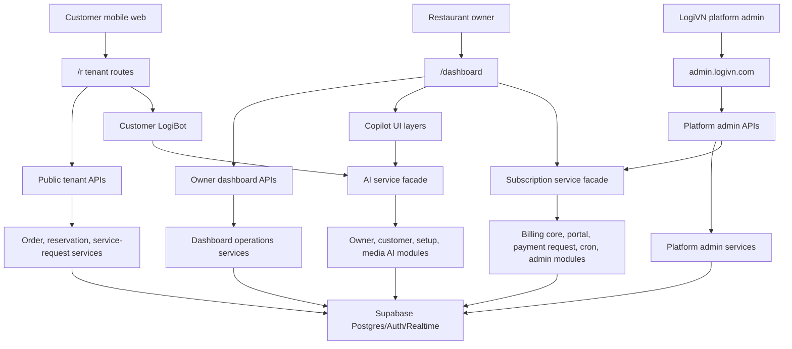

# LogiVN Product Architecture

Date: 2026-05-11

## Architecture Intent

LogiVN is a modular monolith built on Next.js App Router and Supabase. The current architecture should stay monolithic while the product is still converging, but internal boundaries must be explicit enough that billing, AI, operations, and customer flows can scale without becoming one large shared service layer.

Primary architecture goals:

- Keep tenant boundaries obvious at every data access point.
- Keep customer UX mobile-first and fast.
- Keep owner dashboard operations data-first and low-latency.
- Keep AI features contextual, action-oriented, and tenant-scoped.
- Prefer small adapters and facades over broad rewrites.

## System Map

## Runtime Boundaries

### Public Tenant Boundary

Public customer routes and APIs are allowed to create orders, remote orders, reservations, and service requests, but service-role access must stay behind named server-side scopes. New public mutations should not import `createAdminSupabaseClient` directly from route handlers.

Current boundary:

- `services/public-tenant-admin-boundary.ts`
- `services/order-service.ts`
- `services/service-request-service.ts`
- reservation/payment public flows should continue migrating toward the same scoped pattern.

### Owner Dashboard Boundary

The owner dashboard owns restaurant operations: orders, kitchen, tables, menu, online ordering, reservations, payments, reports, staff, and settings. Dashboard server actions are exposed through `app/dashboard/actions.ts`, but implementation must remain split by domain under `app/dashboard/actions/`.

Rules:

- Keep facade exports stable for existing imports.
- Keep mutation authorization inside server actions or services.
- Prefer server-loaded initial data and realtime/client refresh for updates.
- Avoid duplicate initial fetches between page components and live action widgets.

### Billing Boundary

Billing remains a compatibility facade while v2 migration is in progress.

Current modules:

- `services/subscription-service.ts` as compatibility facade.
- `services/billing/subscription-core.ts` for plan/subscription core.
- `services/billing/billing-portal.ts` for owner billing portal snapshots.
- `services/billing/payment-request.ts` for VietQR subscription payment requests.
- `services/billing/billing-v2-bridge.ts` for temporary v2 compatibility.
- `services/billing/subscription-cron.ts` for scheduled lifecycle updates.
- `services/billing/payment-admin.ts` for platform confirmation/rejection.

P2 direction:

- Shrink legacy bridge code behind adapters.
- Move dual-write behavior toward one explicit cutover seam.
- Keep old and new deployment versions compatible until dual-write removal is proven.

### AI Boundary

AI should behave like a product capability layer, not a generic chatbot surface.

Current modules:

- `services/ai-service.ts` as compatibility facade.
- `services/ai/owner.ts`
- `services/ai/customer.ts`
- `services/ai/setup.ts`
- `services/ai/media.ts`
- `services/ai/runtime.ts`

Rules:

- Tenant data must be scoped before model/tool execution.
- Tool results should be translated into product cards/actions, not raw internal tool output.
- AI provider routing should keep latency, quota, and failure metadata observable.

## Data And Trust Boundaries

Supabase service-role access is acceptable for trusted server-side jobs, platform admin, and legacy migration bridges. It is risky in public tenant flows unless wrapped in named repository or boundary scopes.

Preferred direction:

- Public APIs validate rate limits, schema, and tenant access before service writes.
- Services apply `restaurant_id` constraints on every tenant query.
- Payment and reservation state changes write idempotent audit/payment logs.
- Platform admin support access should be reason-scoped, time-limited, read-only by default, and audited.

## Frontend Boundaries

Frontend surfaces should remain independently understandable:

- Landing and SEO pages: static-first, optimized for discovery.
- Customer ordering: mobile-first, compact, low-latency, no dashboard-only dependencies.
- Owner dashboard: operational density, fast actions, URL-shareable state for support.
- Platform admin: observability and controlled mutations, never tenant-private leakage by default.

P2 frontend priorities:

- Split customer order clients by behavior before adding more payment/promotion states.
- Make operational state URL-backed where support/debugging benefits.
- Keep map and AI bundles loaded only on routes that need them.
- Run responsive smoke checks before production UI releases.

## Validation Contract

Normal development should pass:

- `git diff --check`
- `npm run lint`
- `npx tsc --noEmit`
- focused tests for changed behavior

Release-sensitive work should also pass:

- `npm run build`
- `npm test`
- `npm run infra:check` when service-role or route boundaries change
- `npm run responsive:smoke` when UI layout risk is material and a running app URL is available
- `npm run seo:audit` for public marketing/SEO route changes
