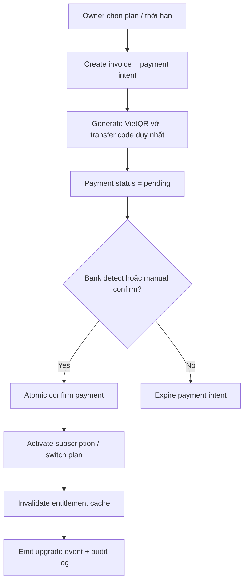
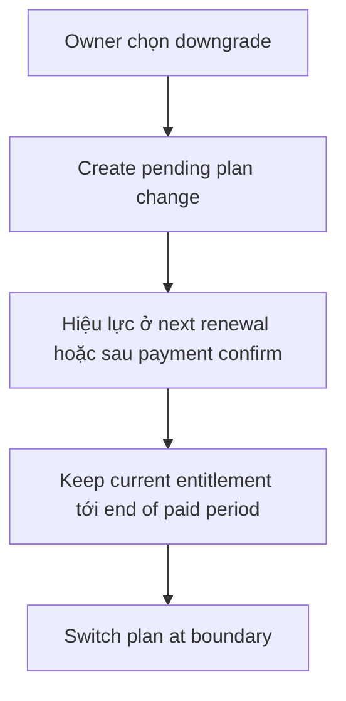
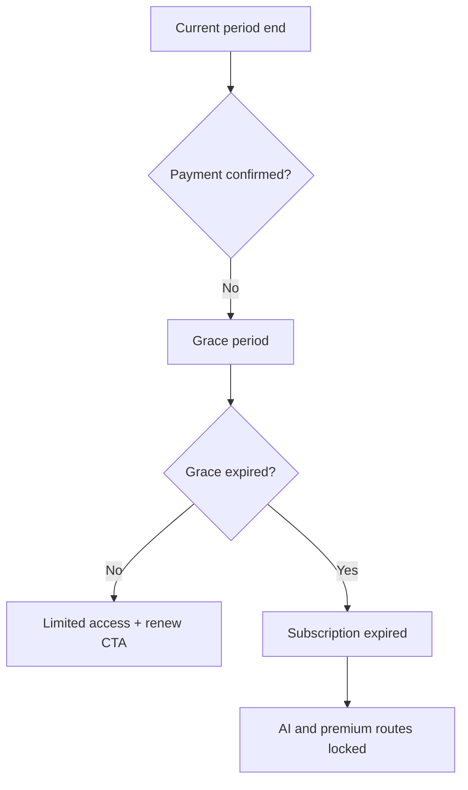

# LogiVN Subscription / Billing / Entitlement Architecture

## 1. Overall architecture

LogiVN nên chạy theo mô hình `billing kernel` tập trung:

- `subscription_plans` và `plan_entitlements` là nguồn sự thật duy nhất cho plan logic.
- `subscriptions`, `invoices`, `payments`, `payment_logs` quản lý lifecycle thương mại.
- `usage_quotas`, `feature_usage_logs`, `ai_usage_logs`, `trial_usage` quản lý entitlement động và AI quota.
- `upgrade_events` và `audit_logs` phục vụ conversion analytics, support và forensic.
- `EntitlementProvider` + `FeatureGate` là lớp UI duy nhất để render state `ACTIVE / LOCKED_PLAN / QUOTA_EXCEEDED / TRIAL_USED`.
- Middleware chỉ dùng để chặn route cấp cao; API và server action luôn re-check entitlement server-side.

Luồng chuẩn:

1. User vào dashboard hoặc API.
2. Server đọc subscription hiện tại + entitlement cache.
3. Server resolve feature state + quota state.
4. UI render usable state hoặc locked preview state.
5. Khi AI/action chạy, usage ledger được ghi ngay vào `feature_usage_logs` và aggregate vào `usage_quotas`.
6. Khi payment được xác nhận, subscription được promote atomically và cache bị invalidated.

## 2. Database schema

Thiết kế production nên chia rõ:

- Catalog: `subscription_plans`, `feature_flags`, `plan_entitlements`
- Commerce: `subscriptions`, `invoices`, `payments`, `payment_logs`
- Usage: `usage_quotas`, `trial_usage`, `feature_usage_logs`, `ai_usage_logs`
- Tenant: `restaurants`, `restaurant_members`
- Audit: `audit_logs`, `upgrade_events`

Nguyên tắc:

- UUID everywhere
- `created_at`, `updated_at`, `deleted_at`
- soft delete cho dữ liệu thương mại
- unique/index theo `restaurant_id + status + period`
- append-only log tables cho payment, usage, audit
- RLS theo `current_restaurant_id()`

## 3. Entitlement architecture

Resolver entitlement nên trả về snapshot chuẩn:

```ts
type ResolvedEntitlement = {
  restaurantId: string;
  planCode: "pro" | "premium";
  subscriptionStatus: "trialing" | "active" | "grace" | "expired" | "pending_payment";
  validUntil: string | null;
  features: Record<string, ResolvedFeatureAccess>;
  quotas: Record<string, QuotaSnapshot>;
};
```

Rules:

- Không scatter `if (plan === "premium")` trong UI/API.
- Mọi logic unlock/limit/trial phải đi qua resolver.
- Resolver cache ngắn ở memory/Redis và invalidated khi subscription/payment/override/usage đổi.
- Middleware chỉ dùng result rút gọn, API dùng full snapshot.

## 4. Feature gating architecture

Feature gating có 5 lớp:

1. DB: `plan_entitlements`, `usage_quotas`, `trial_usage`
2. Server resolver: resolve feature state
3. API guard: `assertServerFeatureAccess`
4. Middleware guard: chặn route nguyên cụm như `/dashboard/analytics/ai`
5. Component guard: `FeatureGate`

State machine:

- `ACTIVE`: usable
- `LOCKED_PLAN`: show preview + upgrade CTA
- `QUOTA_EXCEEDED`: show progress + CTA
- `TRIAL_USED`: show one-time-trial exhausted state

## 5. Billing flow diagrams

### Upgrade / renew



### Downgrade



### Expire / grace



## 6. AI routing strategy

Router 3 tầng:

- `Xiaomi MiMo` first cho menu generation, OCR, assistant vận hành, chatbot và báo cáo dài context
- `DeepSeek` và `Gemini Flash` làm fallback text khi MiMo timeout, lỗi provider, hoặc chạm token guard theo task/ngày
- `xAI` cho image-oriented flows hoặc các use case riêng cần model đó
- `hybrid` cho business advisor, AI assistant nâng cao, premium workflows

Rules:

- route theo `feature_key`, tenant tier, budget envelope, latency target
- log provider/model/tokens/cost vào `ai_usage_logs`
- aggregate vào `usage_quotas`
- fallback only if request vẫn còn quota và policy cho phép

## 7. Quota strategy

Quota nên tách theo dimension:

- `tables`
- `staff`
- `ai_requests`
- `ai_tokens`
- `ai_images`
- `exports`
- `analytics_runs`
- `automation_runs`

Window:

- `monthly` cho AI/image/export
- `daily` cho realtime assistant burst
- `lifetime` cho `trial_usage`

PRO:

- hard limit cho `tables=20`, `staff=10`
- monthly AI quota thấp nhưng đủ demo giá trị

PREMIUM:

- `tables/staff` unlimited
- AI multiplier lớn
- quota mềm cho cost control nội bộ, không phải UX cap lộ liễu

## 8. Payment architecture

VietQR flow:

- mỗi payment intent có `transfer_code` unique
- QR encode amount + transfer code
- pending payment chỉ có một payment active cho cùng invoice/subscription
- duplicate transfer code bị reject
- confirmed payment phải chạy qua RPC/transaction lock

Future ready:

- bank webhook ingestion
- statement/email parser worker
- replay protection qua `idempotency_key`, `provider_reference`, signature log

## 9. Security strategy

- frontend không phải trust boundary
- entitlement check lại ở server/API
- payment confirm chạy atomic RPC + row lock
- audit mọi hành động billing quan trọng
- service role only cho cron/confirm/payment reconciliation
- RLS trên commerce + usage tables
- signed payment request metadata để detect forged approval flow

## 10. Scaling strategy

- L1 cache in-process cho entitlement snapshot
- L2 Redis optional cho multi-instance
- aggregate usage vào `usage_quotas`, không query raw logs cho mọi request
- cron expire/reminder/payment reconciliation riêng
- billing routes tách khỏi hot order path
- realtime usage event có thể đẩy qua Supabase Realtime hoặc Redis stream khi scale lớn hơn

## 11. Conversion UX strategy

Mục tiêu là `visible but locked`, không ẩn feature premium:

- locked card vẫn giữ nội dung preview
- blur nhẹ 4-6px, overlay gradient tinh tế
- badge `PREMIUM` / `AI` / `NEW`
- CTA contextual, không spam
- quota bar luôn nhìn thấy mức đã dùng
- trial feature cho AI hero features như branding/analytics/image
- modal upgrade giải thích outcome, không chỉ giá

## 12. Folder structure

```txt
app/
  api/
    admin/billing/
    copilotkit/
components/
  billing/
lib/
  billing/
services/
  subscription-service.ts        # legacy bridge
  payment-service.ts             # order payment
  billing/                       # future split services
stores/
  use-upgrade-flow.ts
supabase/
  migrations/
```

## 13. Reusable component structure

- `FeatureGate`
- `PremiumBadge`
- `UpgradeModal`
- `LockedCard`
- `QuotaProgress`
- `TrialUsedOverlay`
- `UsageBar`
- `UpgradeBanner`
- `PlanComparisonTable`
- `BillingCard`
- `AIQuotaWidget`
- `EntitlementProvider`

## 14. Deployment strategy

- Vercel app handles UI + API guards
- Supabase Postgres stores billing source of truth
- Edge-safe entitlement payload can be computed server-side and cached
- cron jobs:
  - payment expiration
  - grace/expiry sweep
  - reminder emails
  - usage reset
- optional VPS worker:
  - bank statement parser
  - email parsing
  - heavy reconciliation jobs

## Rollout plan

1. Add additive billing v2 schema beside current billing tables.
2. Keep current flows alive via legacy bridge.
3. Move UI gating to `FeatureGate`.
4. Move AI usage tracking to centralized quota ledger.
5. Switch billing portal from `subscription_payment_logs` to invoice/payment model.
6. Turn on reconciliation worker and richer analytics after data backfill.
