# Design Document

## Overview

Tài liệu thiết kế kỹ thuật cho 20 nâng cấp LogiMail (+ R21 biên giới/idempotency), bám sát backend thật: Next.js `apps/logimail-web` (API routes `src/app/api/logimail/*`, server libs `src/lib/*`), Supabase schema `logimail`, mail engine IMAP/SMTP tới BillionMail/Postfix/Dovecot/Rspamd, DNS qua Cloudflare. Thiết kế **mở rộng** các service/bảng có sẵn thay vì viết lại.

Bốn trụ cột ánh xạ thành các nhóm thành phần server-side mới trong `src/lib/`, các route handler mới dưới `/api/logimail/admin/*` (vận hành) và `/api/logimail/mail/*` (gửi), cộng cron worker cho tác vụ nền (warm-up, alert, placement, key-rotation).

Nguyên tắc xuyên suốt (kế thừa từ requirements):
- `domains.*_status` = cache trạng thái mới nhất; `deliverability_checks` = lịch sử từng lần kiểm.
- **Sending_Domain** (domain gốc hoặc subdomain có stream type) là đơn vị mang reputation/score/quota/DKIM selector.
- Mọi bảng/cột mới nằm trong schema `logimail`, không đụng `public` (R21).
- Hành động ghi `audit_logs` bất biến; thao tác nguy hiểm cần xác nhận.

## Architecture

```mermaid
flowchart TB
  subgraph Client
    Console["domain.logivn.com console (admin/owner)"]
    MailUI["mail.logivn.com client"]
  end

  subgraph API["Next.js API /api/logimail"]
    AdminAPI["/admin/* (requireAdmin)"]
    MailAPI["/mail/* (requireMailSession)"]
    IngestAPI["/ingest/dmarc, /ingest/bounce (signed)"]
  end

  subgraph Domains["Deliverability"]
    DKIM[DKIM_Manager]
    Auth[Auth_Record_Service]
    PTR[PTR_Verifier]
    Deliver[Deliverability_Engine]
    Warm[Warmup_Scheduler]
    Bounce[Bounce_Processor + Suppression]
    DMARC[DMARC_Ingestor]
    Place[Placement_Tester]
    Score[Content_Scorer]
  end

  subgraph Ops["Operational"]
    Approval[Approval_Engine]
    Bulk[Bulk_Service]
    Alert[Alerting_Service / SLA_Tracker]
    Dash[Health_Dashboard]
    Runbook[Runbook_Engine]
    DNSProv[DNS_Provisioner -> Cloudflare]
  end

  subgraph Sec["Security"]
    Vault[Credential_Vault]
    KeyRot[Key_Rotation_Service]
    RBAC[RBAC_Service]
    RL[Rate_Limiter + Anti_Abuse]
    Audit[Audit_Service immutable]
    Sess[MFA + Session_Manager]
  end

  subgraph Multi["Multi-domain"]
    MDM[Multi_Domain_Manager]
    Wizard[Domain_Onboarding_Wizard]
  end

  subgraph Infra
    DB[(Supabase schema logimail)]
    SMTP["BillionMail/Postfix SMTP"]
    IMAP["Dovecot IMAP (pool)"]
    CF["Cloudflare DNS API"]
    Cron["Cron workers (Vercel/VPS)"]
  end

  Console --> AdminAPI
  MailUI --> MailAPI
  AdminAPI --> RBAC --> Domains & Ops & Multi & Sec
  MailAPI --> Score & Bounce & Vault
  IngestAPI --> DMARC & Bounce
  Domains --> DB
  Ops --> DB
  Multi --> DB
  Sec --> DB
  DNSProv --> CF
  Auth --> CF
  Vault --> SMTP & IMAP
  Cron --> Warm & Alert & Place & KeyRot & DMARC
  AdminAPI --> Audit
```



## Components and Interfaces

Mỗi thành phần là một module trong `src/lib/`, gọi qua route handler. Tất cả dùng `createLogimailServiceStore()` (service-role, `db.schema:'logimail'`) và `writeAuditLog()` đã có.

### Deliverability
- **`lib/deliverability/auth-records.ts` (Auth_Record_Service)** — `buildExpectedRecords(sendingDomain)` trả nội dung SPF/DKIM/DMARC/BIMI/MTA-STS/TLS-RPT mong đợi; `checkAuthRecords(sendingDomainId)` resolve DNS thật (`node:dns/promises`), ghi 1 dòng `deliverability_checks` + cập nhật cache `domains.*_status`. Phát hiện SPF trùng → `fail`. (R2)
- **`lib/deliverability/dkim.ts` (DKIM_Manager)** — CRUD selector trong bảng `dkim_selectors`; lấy/sinh khóa (BillionMail-managed hoặc RSA-2048 nội bộ, private key vào Credential_Vault); rotate giữ selector cũ resolvable 7 ngày. (R1, R14)
- **`lib/deliverability/ptr.ts` (PTR_Verifier)** — reverse lookup IP gửi so với mail hostname → `ptr_status`. (R3)
- **`lib/deliverability/score.ts` (Deliverability_Engine)** — tính score 0–100 từ trạng thái auth + placement + bounce rate. (R2.5, R18.2)
- **`lib/deliverability/warmup.ts` (Warmup_Scheduler)** — tạo/đẩy `warmup_plans`, mỗi ngày set `domain_quotas.daily_send_limit` của Sending_Domain. (R4)
- **`lib/deliverability/bounce.ts` (Bounce_Processor)** — phân loại event, dedupe theo `provider_message_id`, ghi `bounce_events`, cập nhật `suppression_list`. (R5)
- **`lib/deliverability/dmarc.ts` (DMARC_Ingestor)** — `parseAggregateReport(xml)`, `printAggregateReport(records)` (round-trip), ghi `dmarc_reports`, summary pass-rate có giới hạn 30 ngày + phân trang 200. (R6)
- **`lib/deliverability/placement.ts` (Placement_Tester)** — gửi tới seed-list, thu kết quả inbox/spam/missing, ghi tỉ lệ vào `deliverability_checks.notes`. (R7)
- **`lib/deliverability/content-score.ts` (Content_Scorer)** — chấm spam 0–10 deterministic (rule-based, có thể gọi Rspamd), trả rule ids. (R8)

### Operational
- **`lib/admin-service.ts` mở rộng (Approval_Engine, Bulk_Service)** — `getApprovalQueue/approveRequest/rejectRequest` đã có; thêm `evaluateAutoApproval(request)` + `runBulk(action, ids[])` (cap 500). (R9, R10)
- **`lib/ops/alerting.ts` (Alerting_Service + SLA_Tracker)** — tính bounce rate/SLA, ghi `alerts`. Cron quét pending quá hạn. (R11)
- **`lib/ops/runbook.ts` (Runbook_Engine)** — chạy steps theo thứ tự, ghi `runbook_runs`. (R12.1)
- **`lib/ops/dns-provisioner.ts` (DNS_Provisioner)** — Cloudflare API trong scope; idempotent (chỉ tạo khi chưa có), proxy-off cho mail host, dừng + báo cáo khi lỗi. (R12, R21)

### Security
- **`lib/mail-credentials.ts` nâng cấp (Credential_Vault + Key_Rotation_Service)** — chuyển từ single static key sang **envelope**: KEK trong env, DEK per-record, `key_version` lưu kèm ciphertext (bảng `encryption_keys`). Rotate re-encrypt nền. (R13, R14)
- **`lib/admin-access.ts` mở rộng (RBAC_Service)** — thêm role `member`/`viewer`, helper `requireRole(action)`. (R15)
- **`lib/rate-limit.ts` mở rộng + `lib/anti-abuse.ts`** — dùng `enforceRateLimit` hiện có; thêm send-rate guard per mailbox. (R16)
- **`lib/audit-log.ts` + DB trigger** — append-only; trigger chặn UPDATE/DELETE trên `audit_logs`. (R17.1–2)
- **`lib/security/session.ts` (MFA + Session_Manager)** — dựa Supabase Auth MFA + bảng `mail_sessions` revoke/idle-timeout. (R17.3–5)

### Multi-domain
- **`lib/multi-domain.ts` (Multi_Domain_Manager)** — list Sending_Domain (phân trang 100), quota per-domain, route theo stream type. (R18, R20)
- **`lib/onboarding.ts` (Domain_Onboarding_Wizard)** — wizard nhiều bước, lưu `cloudflare_zone_id`/`dns_plan` vào `domain_requests`, verify. (R19)

## Data Models

Tất cả bảng/cột mới thuộc schema `logimail`, bật RLS theo workspace membership (như các bảng hiện có), service-role bypass cho backend.

### Sending_Domain (mở rộng `domains`)
Thay vì bảng mới, mở rộng `domains` để biểu diễn cả subdomain gửi:
```sql
alter table logimail.domains
  add column parent_domain_id uuid references logimail.domains(id),  -- null = root
  add column stream_type text check (stream_type in ('transactional','marketing')) default 'transactional',
  add column bimi_status text default 'unknown',
  add column mta_sts_status text default 'unknown',
  add column sending_ip inet;            -- IP gửi để PTR check (R3)
```
`domains.*_status` = cache mới nhất (R2.6). Một root domain có nhiều bản ghi con (subdomain) làm Sending_Domain riêng cho stream marketing/transactional (R20).

### `dkim_selectors` (R1, R14)
```sql
create table logimail.dkim_selectors (
  id uuid primary key default gen_random_uuid(),
  domain_id uuid not null references logimail.domains(id) on delete cascade,
  selector text not null check (selector ~ '^[a-z0-9]([a-z0-9-]*[a-z0-9])?$' and length(selector) between 1 and 63),
  public_key text not null,
  encrypted_private_key text,            -- null nếu BillionMail-managed
  key_source text not null check (key_source in ('billionmail','logimail')),
  status text not null default 'active' check (status in ('active','retired')),
  retired_at timestamptz,                -- resolvable +7 ngày
  created_at timestamptz default now(),
  unique (domain_id, selector)           -- R1.4
);
```

### `domain_quotas` (R4, R18) — quota theo Sending_Domain
```sql
create table logimail.domain_quotas (
  domain_id uuid primary key references logimail.domains(id) on delete cascade,
  daily_send_limit integer not null default 200,
  used_today integer not null default 0,
  usage_date date not null default current_date,
  updated_at timestamptz default now()
);
```
> Quyết định: tách khỏi `quotas` (workspace-scoped, giữ cho hạn mức tổng) để có hạn mức per-domain (giải A1). Khi gửi, enforce min(domain_quota, workspace_quota).

### `warmup_plans` (R4)
```sql
create table logimail.warmup_plans (
  id uuid primary key default gen_random_uuid(),
  domain_id uuid not null references logimail.domains(id) on delete cascade,
  start_limit integer not null default 50,
  daily_multiplier numeric not null default 2.0,
  target_limit integer not null,
  current_day integer not null default 1,
  status text not null default 'active' check (status in ('active','completed','paused')),
  started_at timestamptz default now()
);
```

### `suppression_list` (R5)
```sql
create table logimail.suppression_list (
  id uuid primary key default gen_random_uuid(),
  workspace_id uuid not null references logimail.workspaces(id) on delete cascade,
  recipient_email text not null,
  reason text not null check (reason in ('hard_bounce','complaint','manual')),
  source_event_id uuid references logimail.bounce_events(id),
  created_at timestamptz default now(),
  unique (workspace_id, recipient_email)
);
alter table logimail.bounce_events add column provider_message_id text; -- dedupe (R5.2)
create unique index bounce_events_provider_msg_uidx on logimail.bounce_events(provider_message_id) where provider_message_id is not null;
```

### `encryption_keys` + cột key_version (R13, R14)
```sql
create table logimail.encryption_keys (
  version integer primary key,
  status text not null check (status in ('active','retiring','retired')),
  created_at timestamptz default now()
);
alter table logimail.mailboxes add column credential_key_version integer references logimail.encryption_keys(version);
```
Ciphertext format đổi từ `v1.iv.tag.data` → `v{key_version}.iv.tag.encDek...` (envelope: DEK mã hóa bởi KEK env).

### `alerts`, `runbooks`/`runbook_runs`, `seed_placement_tests` (R7, R11, R12)
```sql
create table logimail.alerts (
  id uuid primary key default gen_random_uuid(),
  workspace_id uuid references logimail.workspaces(id),
  kind text not null,                    -- bounce_rate | sla_breach | anti_abuse | dns
  severity text not null check (severity in ('info','warning','critical')),
  message text not null,
  metadata jsonb default '{}',
  resolved_at timestamptz,
  created_at timestamptz default now()
);
create table logimail.runbook_runs (
  id uuid primary key default gen_random_uuid(),
  runbook_key text not null,
  actor_id uuid,
  steps jsonb not null,                  -- [{step, status, detail}]
  status text not null default 'running',
  created_at timestamptz default now()
);
create table logimail.seed_placement_tests (
  id uuid primary key default gen_random_uuid(),
  domain_id uuid not null references logimail.domains(id) on delete cascade,
  marker text not null,
  results jsonb default '[]',            -- [{provider, folder}]
  inbox_rate numeric,
  created_at timestamptz default now()
);
```
`dmarc_reports` đã có; chỉ bổ sung index theo `(domain_id, created_at)` cho summary phân trang.

### `audit_logs` bất biến (R17)
```sql
create rule audit_logs_no_update as on update to logimail.audit_logs do instead nothing;
create rule audit_logs_no_delete as on delete to logimail.audit_logs do instead nothing;
```

## API Surface

| Route | Method | Auth | Requirement |
|---|---|---|---|
| `/api/logimail/admin/domains/[id]/dkim` | GET/POST/DELETE | requireAdmin | R1 |
| `/api/logimail/admin/domains/[id]/auth-records` | GET | requireAdmin(read) | R2.1 |
| `/api/logimail/admin/domains/[id]/auth-check` | POST | requireAdmin(write) | R2, R3 |
| `/api/logimail/admin/domains/[id]/warmup` | POST/DELETE | requireAdmin(write) | R4 |
| `/api/logimail/admin/domains/[id]/dns-provision` | POST | requireAdmin(dangerous) | R12, R21 |
| `/api/logimail/admin/domains/[id]/placement-test` | POST | requireAdmin(write) | R7 |
| `/api/logimail/admin/domains` (list) | GET | requireAdmin(read) | R18 (phân trang 100) |
| `/api/logimail/admin/onboarding` | POST (step) | requireAdmin(write) | R19 |
| `/api/logimail/admin/suppression` | GET/POST/DELETE | requireAdmin | R5 |
| `/api/logimail/admin/dmarc/summary` | GET | requireAdmin(read) | R6.5–6 |
| `/api/logimail/ingest/dmarc` | POST (signed key) | internal key | R6.1–4 |
| `/api/logimail/ingest/bounce` | POST (signed key) | internal key | R5 |
| `/api/logimail/admin/requests/auto-rules` | GET/PUT | requireAdmin | R9 |
| `/api/logimail/admin/bulk` | POST | requireAdmin(write) | R10 |
| `/api/logimail/admin/alerts` | GET/POST(resolve) | requireAdmin | R11 |
| `/api/logimail/admin/runbooks/[key]/run` | POST | requireAdmin(dangerous) | R12 |
| `/api/logimail/admin/keys/rotate` | POST | requireAdmin(dangerous) | R14 |
| `/api/logimail/admin/sessions` | GET/DELETE(revoke) | requireAdmin | R17.4 |
| `/api/logimail/mail/content-score` | POST | requireMailSession | R8 |
| `/api/logimail/admin/overview` (mở rộng) | GET | requireAdmin(read) | R11.1 dashboard |

Cron (Vercel `vercel.json` + worker): `cron/warmup-tick`, `cron/alerts-scan`, `cron/key-rotation-step`, `cron/placement-collect`.

## Cross-Cutting Concerns

### Envelope encryption & key rotation (R13, R14)
- KEK lấy từ env `LOGIMAIL_CREDENTIAL_ENCRYPTION_KEY` (đã có). Mỗi credential sinh DEK ngẫu nhiên; data mã hóa bằng DEK (AES-256-GCM), DEK mã hóa bằng KEK; lưu `v{key_version}.ivDek.tagDek.encDek.iv.tag.data`.
- `encryption_keys.version` đánh dấu key active. Rotate: tạo version mới `active`, đánh dấu cũ `retiring`, cron `key-rotation-step` re-encrypt theo lô (đọc bằng version ghi kèm record — R14.2), hoàn tất ghi audit + count; lỗi giữa chừng giữ version cũ cho record chưa xử lý (R14.4).
- Backend không bao giờ trả plaintext ra client (R13.2). Lỗi giải mã → audit không log ciphertext (R13.4).

### Cloudflare provisioning idempotency (R12, R21)
- Trước khi tạo record, `DNS_Provisioner` liệt kê record hiện có trong zone (`Zone:Read`), so khớp type+name+content; chỉ tạo khi chưa tồn tại. Sửa/xóa → cần confirm header `x-logimail-confirm` (đã có cơ chế dangerous). Mail transport host luôn `proxied=false`. Lỗi API → dừng, báo applied/skipped/failed. Re-run toàn bộ tồn tại → `already_applied`.

### DMARC round-trip (R6.4)
- `parseAggregateReport` (XML → records[]) và `printAggregateReport` (records[] → XML). Test property: `parse(print(parse(xml)))` cho tập record tương đương `parse(xml)` (chuẩn hóa thứ tự/định dạng số).

### Deterministic content scoring (R8.4)
- Rule-based thuần (regex/heuristic + tùy chọn Rspamd với input cố định), không dùng yếu tố thời gian/ngẫu nhiên → cùng nội dung luôn cùng score.

### Quota enforcement khi gửi (R4, R18, R20)
- `sendMailThroughMailbox` (mail-client) thêm bước: resolve Sending_Domain theo from-address/stream type → kiểm `domain_quotas` (reset theo `usage_date`) và `suppression_list` trước khi gửi; vượt → `quota_exceeded`/`suppressed`. Tăng `used_today` sau khi gửi thành công.

### Rate limiting & anti-abuse (R16)
- Tái dùng `enforceRateLimit(request, scope, limit, windowMs)`; thêm scope cho endpoint mới. Anti-abuse: đếm `email_send_logs` theo mailbox/giờ; vượt 300 → pause + alert.

### Audit immutability (R17)
- DB rules chặn UPDATE/DELETE; mọi action admin gọi `writeAuditLog`.

## Correctness Properties

Các bất biến cần được kiểm chứng (đa số bằng property-based test):

### Property 1: DMARC round-trip
**Validates: Requirements 6.4**
Với mọi report XML hợp lệ, `parse(print(parse(xml)))` cho tập record tương đương `parse(xml)` (chuẩn hóa thứ tự + định dạng số).

### Property 2: Credential envelope round-trip
**Validates: Requirements 13.3**
Với mọi credential `c` và mọi `key_version` hợp lệ, `decrypt(encrypt(c)) == c`; ciphertext không chứa plaintext.

### Property 3: Content score determinism
**Validates: Requirements 8.4**
Với nội dung giống nhau, `score(content)` luôn trả cùng giá trị và cùng tập rule ids.

### Property 4: Provisioning idempotency
**Validates: Requirements 21.2, 21.4**
Chạy plan N lần (N≥2) cho cùng Sending_Domain tạo ra cùng tập record như chạy 1 lần; lần chạy lại không tạo bản ghi trùng và báo `already_applied`.

### Property 5: DKIM selector uniqueness
**Validates: Requirements 1.4**
Không tồn tại hai selector cùng tên cho cùng domain tại bất kỳ thời điểm nào.

### Property 6: Quota monotonic & bounded
**Validates: Requirements 4.3, 18.3**
Tổng số thư gửi trong ngày của một Sending_Domain không vượt `daily_send_limit`; `used_today` reset đúng khi `usage_date` đổi.

### Property 7: Suppression enforcement
**Validates: Requirements 5.4**
Nếu địa chỉ thuộc `suppression_list` của workspace thì không có lệnh gửi nào tới địa chỉ đó thành công cho tới khi được gỡ.

### Property 8: Audit immutability
**Validates: Requirements 17.2**
Với mọi dòng `audit_logs`, mọi UPDATE/DELETE đều không làm thay đổi nội dung dòng đó.

### Property 9: Per-domain isolation
**Validates: Requirements 18.3, 20.3**
Chạm hạn mức/score của một Sending_Domain không thay đổi hạn mức/score của Sending_Domain khác.

### Property 10: Score range
**Validates: Requirements 2.5**
Mọi deliverability score luôn là số nguyên trong [0, 100].

## Error Handling
- Chuẩn hóa qua `jsonError(code, message, status)` đã có. Map lỗi domain: `quota_exceeded`(429), `suppressed`(409), `dkim_selector_conflict`(409), `dns_parse_error`(400), `cloudflare_error`(502, kèm applied/skipped), `decryption_error`(500, audit), `forbidden`(403 RBAC), `rate_limited`(429 + Retry-After).
- Provisioning/runbook lỗi giữa chừng: trả danh sách bước đã chạy + bước lỗi, không rollback tự động (vận hành xác nhận).

## Testing Strategy
- **Unit**: mỗi service lib (auth-records DNS mock, ptr, warmup math, bounce classify+dedupe, suppression enforce, score determinism, rbac matrix, rate-limit window).
- **Property-based** (⚠ chạy có cảnh báo):
  - DMARC `parse/print` round-trip (R6.4).
  - Credential envelope `decrypt(encrypt(x)) == x` qua nhiều key_version (R13.3).
  - Content score determinism trên tập input ngẫu nhiên (R8.4).
- **Idempotency**: provision 2 lần → lần 2 `already_applied`, không tạo trùng (R21.2/4).
- **Integration** (cần staging mail + Supabase `logimail`): auth-check ghi `deliverability_checks` + cập nhật cache; gửi vượt quota bị chặn; key rotation re-encrypt rồi vẫn IMAP login được.
- **Migration test**: tất cả object mới ở schema `logimail`, audit_logs immutability rules hoạt động.

## Design Decisions & Trade-offs
1. **Mở rộng `domains` cho subdomain thay vì bảng `sending_domains` riêng** — giảm phân mảnh, tái dùng DNS/score sẵn có; đánh đổi: thêm `parent_domain_id` self-reference.
2. **`domain_quotas` tách khỏi `quotas`** — để có hạn mức per-Sending_Domain (giải A1) mà không phá quota workspace tổng; enforce min của cả hai.
3. **Envelope encryption thay khóa tĩnh** — cho phép rotation không downtime; đánh đổi: ciphertext dài hơn + cần bảng `encryption_keys`.
4. **Bounce/DMARC qua ingestion endpoint có signed key** thay vì poll — realtime hơn, hợp với BillionMail webhook; cần cấu hình internal key.
5. **Audit immutability bằng DB rules** thay vì chỉ app-layer — chống cả truy cập service-role vô tình.
6. **Content scoring rule-based deterministic** thay vì LLM — đáp ứng R8.4 và tránh chi phí/độ trễ.

## Requirements Traceability

| Requirement | Thành phần thiết kế |
|---|---|
| R1 DKIM selector | `dkim_selectors`, DKIM_Manager, `/admin/domains/[id]/dkim` |
| R2 Auth records | Auth_Record_Service, `deliverability_checks` + cache, `/auth-records`,`/auth-check` |
| R3 PTR | PTR_Verifier, `domains.sending_ip` |
| R4 Warm-up | `warmup_plans`,`domain_quotas`, Warmup_Scheduler, cron warmup-tick |
| R5 Bounce/complaint | Bounce_Processor, `suppression_list`, `/ingest/bounce`, dedupe index |
| R6 DMARC ingest | DMARC_Ingestor, `dmarc_reports`, `/ingest/dmarc`,`/admin/dmarc/summary` |
| R7 Placement | Placement_Tester, `seed_placement_tests`, `/placement-test` |
| R8 Content score | Content_Scorer, `/mail/content-score` |
| R9 Approval automation | Approval_Engine `evaluateAutoApproval`, `/admin/requests/auto-rules` |
| R10 Bulk | Bulk_Service `runBulk`, `/admin/bulk` |
| R11 Alert/Dashboard/SLA | Alerting_Service/SLA_Tracker, `alerts`, `/admin/alerts`, overview |
| R12 Runbook/DNS | Runbook_Engine, DNS_Provisioner, `runbook_runs`, `/dns-provision` |
| R13 Envelope encryption | Credential_Vault, `encryption_keys`, `credential_key_version` |
| R14 Key rotation | Key_Rotation_Service, `/admin/keys/rotate`, cron key-rotation-step |
| R15 RBAC | RBAC_Service (admin-access), role member/viewer |
| R16 Rate limit/anti-abuse | rate-limit.ts, anti-abuse.ts |
| R17 Audit/MFA/Session | audit rules, Session_Manager, `/admin/sessions` |
| R18 Multi-domain | Multi_Domain_Manager, `domain_quotas`, list phân trang |
| R19 Onboarding wizard | Domain_Onboarding_Wizard, `domain_requests.cloudflare_zone_id/dns_plan` |
| R20 Stream subdomain | `domains.parent_domain_id/stream_type`, routing trong send path |
| R21 Schema boundary/idempotency | migrations trong `logimail`, DNS_Provisioner idempotent, audit |
